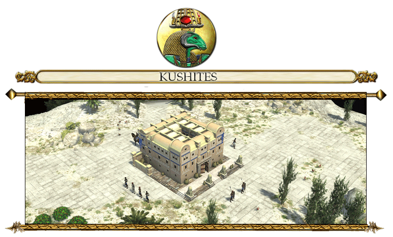

KUSHITE CIVILIZATION PROFILE
==============================

The Kingdom of Kush was an ancient African kingdom situated on the confluences of the Blue Nile,
White Nile and River Atbara in what is now the Republic of Sudan. The Kushite era of rule in the region
was established after the Bronze Age collapse of the New Kingdom of Egypt, and it was centered at
Napata in its early phase. They invaded Egypt in the 8th century BC, and the Kushite emperors ruled as
Pharaohs of the Twenty-fifth dynasty of Egypt for a century, until they were expelled by the Assyrians.
Kushite culture was influenced heavily by the Egyptians, with Kushite pyramid building and monumental
temple architecture still extent. The Kushites even worshipped many Egyptian gods, including Amun.
During Classical antiquity, the Kushite imperial capital was at Meroe. In early Greek geography, the
Meroitic kingdom was known as Aethiopia. The Kushite kingdom persisted until the 4th century AD,
when it weakened and disintegrated due to internal rebellion, eventually succumbing to the rising power
of Axum.

UNIT DESCRIPTIONS
-----------------

### INFANTRY
Archers formed the basic core of Nubian armies that challenged Egypt for control over parts of the Nile
valley, and then conquered Egypt in the 8th century BC, and confronted the troops of the Assyrian
empire. Nubia was the “Land of the Bow”. “Land of the Bow” from the meaning of Ta-Seti, an ancient
Egyptian term used to denote Nubia for thousands of years in antiquity. Nubian archers mostly used
one-piece bows ranging from six to seven feet long, with a powerful draw strength that many of the archers
used their feet to bend their bows. The bows were fabricated from seasoned palm wood, with the arrows
made of cane. Arrows were sometimes poisoned.

### UNIT TEMPLATES

| Template                              | Specific Name  | Generic Name                      |
|---------------------------------------|----------------|-----------------------------------|
| `kush_infantry_archer_a.xml`          | Pdty Nhsyw     | Nubian Archer **(Advanced)**      |
| `kush_infantry_archer_b.xml`          | Pdty Nhsyw     | Nubian Archer **(Basic)**         |
| `kush_infantry_archer_e.xml`          | Pdty Nhsyw     | Nubian Archer **(Elite)**         |
| `kush_infantry_clubman_a.xml`         | nhw Noba       | Nuba Clubman **(Advanced)**       |
| `kush_infantry_clubman_b.xml`         | nhw Noba       | Nuba Clubman **(Basic)**          |
| `kush_infantry_clubman_e.xml`         | nhw Noba       | Nuba Clubman **(Elite)**          |
| `kush_infantry_javelinist_merc_a.xml` | nhw ‘h3w Noba  | Nuba Skirmisher **(Advanced)**    |
| `kush_infantry_javelinist_merc_b.xml` | nhw ‘h3w Noba  | Nuba Skirmisher **(Basic)**       |
| `kush_infantry_javelinist_merc_e.xml` | nhw ‘h3w Noba  | Nuba Skirmisher **(Elite)**       |
| `kush_infantry_pikeman_a.xml`         | si3wrd         | Meroitic Pikeman **(Advanced)**   |
| `kush_infantry_pikeman_b.xml`         | si3wrd         | Meroitic Pikeman **(Basic)**      |
| `kush_infantry_pikeman_e.xml`         | si3wrd         | Meroitic Pikeman **(Elite)**      |
| `kush_infantry_spearman_a.xml`        | iry-rdwy Nhsyw | Nubian Spearman **(Advanced)**    |
| `kush_infantry_spearman_b.xml`        | iry-rdwy Nhsyw | Nubian Spearman **(Basic)**       |
| `kush_infantry_spearman_e.xml`        | iry-rdwy Nhsyw | Nubian Spearman **(Elite)**       |
| `kush_infantry_swordsman_a.xml`       | knw hps        | Meroitic Swordsman **(Advanced)** |
| `kush_infantry_swordsman_b.xml`       | knw hps        | Meroitic Swordsman **(Basic)**    |
| `kush_infantry_swordsman_e.xml`       | knw hps        | Meroitic Swordsman **(Elite)**    |

{: style="height:128px;width:128px"}

* **Generic Name: Nubian Archer.**
* **Specific Name: Pdty Nhsyw.**
* **Class:** Archer.
* **History:** Bowmen were the most important force component.
* **Garrison:** 1.
* **Function:** Short-ranged Infantry. Fast Moving.
* **Rank:** Basic, Advanced, Elite
* **Special:** -.

{: style="height:128px;width:128px"}

* **Generic Name: Nuba Clubman.**
* **Specific Name: nhw Noba.**
* **Class:** Swordsman.
* **History:** -
* **Garrison:** 1.
* **Function:** Melee Infantry. Fast Moving.
* **Rank:** Basic, Advanced, Elite
* **Special:** Mercenary.

{: style="height:128px;width:128px"}

* **Generic Name: Meroitic Pikeman.**
* **Specific Name: si3wrd.**
* **Class:** Pikeman.
* **History:** -
* **Garrison:** 1.
* **Function:** Melee Infantry.
* **Rank:** Basic, Advanced, Elite
* **Special:** Mercenary. 3X versus Cavalry
