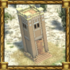
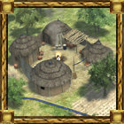

KUSHITE CIVILIZATION PROFILE
==============================

The Kingdom of Kush was an ancient African kingdom situated on the confluences of the Blue Nile,
White Nile and River Atbara in what is now the Republic of Sudan. The Kushite era of rule in the region
was established after the Bronze Age collapse of the New Kingdom of Egypt, and it was centered at
Napata in its early phase. They invaded Egypt in the 8th century BC, and the Kushite emperors ruled as
Pharaohs of the Twenty-fifth dynasty of Egypt for a century, until they were expelled by the Assyrians.
Kushite culture was influenced heavily by the Egyptians, with Kushite pyramid building and monumental
temple architecture still extent. The Kushites even worshipped many Egyptian gods, including Amun.
During Classical antiquity, the Kushite imperial capital was at Meroe. In early Greek geography, the
Meroitic kingdom was known as Aethiopia. The Kushite kingdom persisted until the 4th century AD,
when it weakened and disintegrated due to internal rebellion, eventually succumbing to the rising power
of Axum.

UNIT DESCRIPTIONS
-----------------

### INFANTRY
Archers formed the basic core of Nubian armies that challenged Egypt for control over parts of the Nile
valley, and then conquered Egypt in the 8th century BC, and confronted the troops of the Assyrian
empire. Nubia was the “Land of the Bow”. “Land of the Bow” from the meaning of Ta-Seti, an ancient
Egyptian term used to denote Nubia for thousands of years in antiquity. Nubian archers mostly used
one-piece bows ranging from six to seven feet long, with a powerful draw strength that many of the archers
used their feet to bend their bows. The bows were fabricated from seasoned palm wood, with the arrows
made of cane. Arrows were sometimes poisoned.

### UNIT TEMPLATES

| Template                              | Specific Name  | Generic Name                      |
|---------------------------------------|----------------|-----------------------------------|
| `kush_infantry_archer_a.xml`          | Pdty Nhsyw     | Nubian Archer **(Advanced)**      |
| `kush_infantry_archer_b.xml`          | Pdty Nhsyw     | Nubian Archer **(Basic)**         |
| `kush_infantry_archer_e.xml`          | Pdty Nhsyw     | Nubian Archer **(Elite)**         |
| `kush_infantry_clubman_a.xml`         | nhw Noba       | Nuba Clubman **(Advanced)**       |
| `kush_infantry_clubman_b.xml`         | nhw Noba       | Nuba Clubman **(Basic)**          |
| `kush_infantry_clubman_e.xml`         | nhw Noba       | Nuba Clubman **(Elite)**          |
| `kush_infantry_javelinist_merc_a.xml` | nhw ‘h3w Noba  | Nuba Skirmisher **(Advanced)**    |
| `kush_infantry_javelinist_merc_b.xml` | nhw ‘h3w Noba  | Nuba Skirmisher **(Basic)**       |
| `kush_infantry_javelinist_merc_e.xml` | nhw ‘h3w Noba  | Nuba Skirmisher **(Elite)**       |
| `kush_infantry_pikeman_a.xml`         | si3wrd         | Meroitic Pikeman **(Advanced)**   |
| `kush_infantry_pikeman_b.xml`         | si3wrd         | Meroitic Pikeman **(Basic)**      |
| `kush_infantry_pikeman_e.xml`         | si3wrd         | Meroitic Pikeman **(Elite)**      |
| `kush_infantry_spearman_a.xml`        | iry-rdwy Nhsyw | Nubian Spearman **(Advanced)**    |
| `kush_infantry_spearman_b.xml`        | iry-rdwy Nhsyw | Nubian Spearman **(Basic)**       |
| `kush_infantry_spearman_e.xml`        | iry-rdwy Nhsyw | Nubian Spearman **(Elite)**       |
| `kush_infantry_swordsman_a.xml`       | knw hps        | Meroitic Swordsman **(Advanced)** |
| `kush_infantry_swordsman_b.xml`       | knw hps        | Meroitic Swordsman **(Basic)**    |
| `kush_infantry_swordsman_e.xml`       | knw hps        | Meroitic Swordsman **(Elite)**    |

{: style="height:128px;width:128px"}

* **Generic Name: Nubian Archer.**
* **Specific Name: Pdty Nhsyw.**
* **Class:** Archer.
* **History:** Bowmen were the most important force component.
* **Garrison:** 1.
* **Function:** Short-ranged Infantry. Fast Moving.
* **Rank:** Basic, Advanced, Elite
* **Special:** -.

{: style="height:128px;width:128px"}

* **Generic Name: Nuba Clubman.**
* **Specific Name: nhw Noba.**
* **Class:** Swordsman.
* **History:** -
* **Garrison:** 1.
* **Function:** Melee Infantry. Fast Moving.
* **Rank:** Basic, Advanced, Elite
* **Special:** Mercenary.

{: style="height:128px;width:128px"}

* **Generic Name: Meroitic Pikeman.**
* **Specific Name: si3wrd.**
* **Class:** Pikeman.
* **History:** -
* **Garrison:** 1.
* **Function:** Melee Infantry.
* **Rank:** Basic, Advanced, Elite
* **Special:** Mercenary. 3X versus Cavalry

{: style="height:128px;width:128px"}

* **Generic Name: Nubian Spearman.**
* **Specific Name: iry-rdwy Nhsyw.**
* **Class:** Spearman.
* **History:** -.
* **Garrison:** 1.
* **Function:** Melee Infantry.
* **Special:** Mercenary. 3X versus Cavalry

{: style="height:128px;width:128px"}

* **Generic Name: Meroitic Swordsman.**
* **Specific Name: knw hps.**
* **Class:** Swordsman.
* **History:** -.
* **Garrison:** 1.
* **Function:** Melee Infantry.
* **Special:** -.

{: style="height:128px;width:128px"}

* **Generic Name: Nuba Skirmisher.**
* **Specific Name: nhw ‘h3w Noba.**
* **Class:** Javelinist.
* **History:** -. 
* **Garrison:** 1.
* **Function:** Long-ranged Infantry. Fast Moving. 
* **Special:** Mercenary.

### CAVALRY

While the bulk of Kushite armies were the infantry archers, Nubia’s elite warriors of the time loosed their arrows from horseback and employed thumb rings to increase the force and accuracy of their shots.

### CAVALRY UNIT TEMPLATES

| Template                              | Specific Name    | Generic Name                         |
|---------------------------------------|------------------|--------------------------------------|
| `kush_cavalry_javelinist_a.xml`       | iry hr ssmwtt    | Napatan Light Cavalry **(Advanced)** |
| `kush_cavalry_javelinist_b.xml`       | iry hr ssmwtt    | Napatan Light Cavalry **(Basic)**    |
| `kush_cavalry_javelinist_e.xml`       | iry hr ssmwtt    | Napatan Light Cavalry **(Elite)**    |
| `kush_cavalry_javelinist_merc_a.xml`  | nhw Bulahau gml  | Blemmye Desert Raider **(Advanced)** |
| `kush_cavalry_javelinist_merc_b.xml`  | nhw Bulahau gml  | Blemmye Desert Raider **(Basic)**    |
| `kush_cavalry_javelinist_merc_e.xml`  | nhw Bulahau gml  | Blemmye Desert Raider **(Elite)**    |
| `kush_cavalry_spearman_a.xml`         | Htr              | Meroitic Heavy Cavalry **(Advanced)**|
| `kush_cavalry_spearman_b.xml`         | Htr              | Meroitic Heavy Cavalry **(Basic)**   |
| `kush_cavalry_spearman_e.xml`         | Htr              | Meroitic Heavy Cavalry **(Elite)**   |

{: style="height:128px;width:128px"}

* **Generic Name: Napatan Light Cavalry.**
* **Specific Name: iry hr ssmwtt.**
* **Class:** Cavalry Javelinist.
* **History:** -.
* **Garrison:** 1.
* **Function:**  Ranged cavalry. Fast moving.
* **Special:** -.

{: style="height:128px;width:128px"}

* **Generic Name: Blemmye Desert Raider.**
* **Specific Name: nhw Bulahau gml.**
* **Class:** Cavalry Javelinist.
* **History:** -.
* **Garrison:** 1.
* **Function:** Ranged cavalry. Good hunter and raider. Fast moving.
* **Special:** Mercenary.

{: style="height:128px;width:128px"}

* **Generic Name: Meroitic Heavy Cavalry.**
* **Specific Name: Htr.**
* **Class:** Cavalry Spearman.
* **History:** -.
* **Garrison:** 1.
* **Function:** Ranged cavalry. Good hunter and raider. Fast moving.
* **Special:** 1.5 Vs, Cavalry.

### SUPPORT UNITS

In Nubia, a matrilineal society, women played a key role, almost unheard of in the ancient world. They participated in governance of the kingdom.  The innovation of female rulers represents something not seen in any other major civilization. This was opposed to Egypt, where a few women exercised power as an exception to the rule not as a norm. As a show of how important females were in this joint rule, one of the largest pyramids built for the rulers of Kush was for Queen Shanakdakheto (170-150 B.C.E.), a woman.

### SUPPORT UNIT TEMPLATES

| Template                                | Specific Name    | Generic Name           |
|-----------------------------------------|------------------|------------------------|
| `kush_support_female_citizen.xml`       | Shmt             | Kushite Woman          |
| `kush_support_female_citizen_house.xml` | Shmt             | Kushite Woman          |
| `kush_support_healer_a.xml`             | w’b nsw          | Priest **(Advanced)**  |
| `kush_support_healer_b.xml`             | w’b nsw          | Priest **(Basic)**     |
| `kush_support_healer_e.xml`             | w’b nsw          | Priest **(Elite)**     |
| `kush_support_trader.xml`               | rmt sbt          | Nilotic Merchant       |

{: style="height:128px;width:128px"}

* **Generic Name: Kushite Woman.**
* **Specific Name: Shmt.**
* **Class:** Female Citizen.
* **History:** -.
* **Garrison:** 1.
* **Function:** Quick food gatherer. Slow miner.
* **Special:** *Inspiration Aura* (+10% citizen-soldier productivity - Range of 10m).

Research has discovered that 90% of the bones of ancient Kushites examined from skeletons from the 350 – 550 AD contain traces of the antibiotic tetracycline, including those of 24-month-old infants. Additionally all the bones that were examined were infection free. The Egyptians had a vast knowledge of the human body and were well known for their strong and effective medicines that were said to be to cure any affliction known to man at the time. Based on the research findings, it is likely that the healers of Kush had learned some of these practices.

{: style="height:128px;width:128px"}

* **Generic Name: Priest.**
* **Specific Name: w’b nsw.**
* **Class:** Healer.
* **History:** -.
* **Garrison:** 1.
* **Function:** Heals organic units.
* **Special:** -.

The Kushites were known for their mining of minerals and high-quality stone for trade. The Kushites also introduced and developed iron metallurgy to the region.  Additionally, this region of Africa also produced more gold than anywhere in the world at that time. As middlemen, Kushite traders passed along ivory, ebony, incense, and other exotic goods from the South to the Egyptians who then traded with other Mediterranean peoples.  Kerma, strategically located on the Nile River, controlled the trade routes from the south of Kush to Egypt in the north.  This role as a trade middleman influenced the relationship between Egypt and Kush.  

{: style="height:128px;width:128px"}

* **Generic Name: Nilotic Merchant.**
* **Specific Name: rmt sbt.**
* **Class:** Trader.
* **History:** -.
* **Garrison:** 1.
* **Function:** Sets up trade routes between friendly markets.
* **Special:** -.

### NAVY

The proud ancient Black African civilization of Kush settled along the upper reaches of the Nile. Kush resided in the gold and iron center of the ancient world. It relied on trade as the main source of income and supply. It was also a major exporter of such rare sought after commodities spices and incense. The Kush merchant navy was a major presence and traded throughout the Mediterranean sea, even as far away as India. Information on the Kushite is very scare, but indications point to military vessels being very similar to Egyptian vessels.\

### NAVY UNIT TEMPLATES

| Template                      | Specific Name    | Generic Name               |
|-------------------------------|------------------|----------------------------|
| `kush_ship_bireme.xml`        | Light Warship    | Light Warship              |
| `kush_ship_fishing.xml`       | Wh’-rmw          | Fishing Boat               |
| `kush_ship_merchant.xml`      | D3y sbt          | Nile Trading Barge         |
| `kush_ship_trireme.xml`       | shry ‘3          | Ptolemaic Mercenary Trireme|

{: style="height:128px;width:128px"}

* **Generic Name: Fishing Boat.**
* **Specific Name: Wh’-rmw.**
* **Class:** Fishing Ship.
* **History:** -.
* **Garrison:** Cannot.
* **Garrison Capacity:** 1
* **Function:** Only method of collecting meat from fish.
* **Special:** -.

{: style="height:128px;width:128px"}

* **Generic Name: Nile Trading Barge.**
* **Specific Name: D3y sbt.**
* **Class:** Merchant Ship.
* **History:** -.
* **Garrison:** Cannot.
* **Garrison Capacity:** 15
* **Function:** Sets up trade routes between friendly Ports.
* **Special:** -.

{: style="height:128px;width:128px"}

* **Generic Name: Light Warship.**
* **Specific Name: -.**
* **Class:** Bireme.
* **History:** -.
* **Garrison:** Cannot.
* **Garrison Capacity:** 20
* **Function:** Light ranged war ship.
* **Special:** Garrison units for transport and to increase firepower.

{: style="height:128px;width:128px"}

The first Triremes were built circa 650BC, and by 500BC the Trireme was the most widely used heavy warship. In the Trireme the outriggers were now an integral part of the ship's hull. The Trireme also had a partial or full fighting deck above the rowers. The length of the Trireme remained approximately 35-38 meters, and the beam was approximately meters, and the beam was 3.5 meters. The top speed of a Trireme was approximately 11.5 knots. The Trireme could accelerate much faster than a Bireme and was much more maneuverable. This gave the Trireme an advantage in combat, where higher speed and maneuverability meant a better chance of victory.

* **Generic Name: Ptolemaic Mercenary Trireme.**
* **Specific Name: shry ‘3.**
* **Class:** Trireme.
* **History:** 
* **Garrison:** Cannot.
* **Garrison Capacity:** 30
* **Function:** Medium ranged war ship.
* **Special:** Garrison units for transport and to increase firepower.

### SIEGE UNITS

### SIEGE UNIT TEMPLATES

| Template                          | Specific Name    | Generic Name               |
|-----------------------------------|------------------|----------------------------|
| `kush_mechanical_siege_tower.xml` | iwn n ms         | Kushite Siege Tower        |

{: style="height:128px;width:128px"}

When Demetrius Poliorcetes besieged Salamis, in Cyprus, he instructed that a machine be constructed, which he called "the taker of cities." Its form was that of a square tower, each side 90 cubits high and 45 wide. It rested on four wheels, each eight cubits high. It was divided into nine stories, the lower of which contained machines for throwing great stones, the middle large catapults for throwing spears, and the highest, other machines for throwing smaller stones, together with smaller catapults. It was manned with 200 soldiers, besides those that moved it by pushing the parallel beams at the bottom (Diod. xx.48).

* **Generic Name: Kushite Siege Tower.**
* **Specific Name: iwn n ms.**
* **Class:** Siege Tower
* **History:** -.
* **Garrison:** 5. <== Note largest garrison requirement you're likely to find.
* **Function:** Anti-building siege.
* **Special:** May unload garrisoned units over enemy walls.

### CHAMPION UNITS

### CHAMPION UNIT TEMPLATES

| Template                                | Specific Name    | Generic Name           |
|-----------------------------------------|------------------|------------------------|
| `kush_champion_cavalry.xml`             | Htr Ms’ n mh-ib  | Noble Cavalry          |
| `kush_champion_elephant.xml`            | Abore ‘h3        | Meroitic War Elephant  |
| `kush_champion_infantry.xml`            | Hry pdty         | Noble Archer           |
| `kush_champion_infantry_amun.xml`       | rs ‘Imn          | Napatan Temple Guard   |
| `kush_champion_infantry_apedemak.xml`   | rs ‘Iprmk        | Meroitic Temple Guard  |

{: style="height:128px;width:128px"}

* **Generic Name: Noble Cavalry.**
* **Specific Name: Htr Ms’ n mh-ib.**
* **Class:** Champion Cavalry Spearman.
* **History:** ..
* **Garrison:** 1.
* **Function:** Melee. Ranged Cavalry. Fast moving.
* **Special:** -.

{: style="height:128px;width:128px"}

* **Generic Name: Meroitic War Elephant.**
* **Specific Name: Abore ‘h3.**
* **Class:** Champion Cavalry Unit.
* **History:** -.
* **Garrison:** 1.
* **Function:** Melee. 
* **Special:** -.

{: style="height:128px;width:128px"}

* **Generic Name: Noble Archer.**
* **Specific Name: Hry pdty.**
* **Class:** Champion Infantry Archer.
* **History:** -.
* **Garrison:** 1.
* **Function:** Long-ranged Infantry.
* **Special:** -.

{: style="height:128px;width:128px"}

* **Generic Name: Napatan Temple Guard.**
* **Specific Name: rs ‘Imn.**
* **Class:** Champion Infantry Javelinist.
* **History:** -.
* **Garrison:** 1.
* **Function:** Short-ranged Infantry. Fast moving.
* **Special:** -.

{: style="height:128px;width:128px"}

* **Generic Name: Meroitic Temple Guard.**
* **Specific Name: rs ‘Iprmk.**
* **Class:** Champion Infantry Swordsman.
* **History:** -.
* **Garrison:** 1.
* **Function:** Heavy melee infantry.
* **Special:** -.

### KUSHITE HEROES

### HERO UNIT TEMPLATES

| Template                    | Specific Name               | Generic Name     |
|-----------------------------|-----------------------------|------------------|
| `kush_hero_amanirenas.xml`  | Amnirense qore li kdwe li   | Amanirenas       |
| `kush_hero_arakamani.xml`   | ‘Irk.‘Imn                   | Arakamani        |
| `kush_hero_harsiotef.xml`   | Nastasen Ankhkhare          | Nastasen         |
| `kush_hero_nastasen.xml`    | Nastasen Ankhkhare          | Nastasen         |

{: style="height:128px;width:128px"}

* **Generic Name: Amanirenas.**
* **Specific Name: Amnirense qore li kdwe li.**
* **Class:** Hero Archer
* **History:** .
* **Garrison:** 1.
* **Function:** Ranged Archer. 
* **Special:** *Inspired Defense Aura* (When garrisoned in a structure or a siege engine. The hero gives it a bonus of +2 capture points recovery rate). *Warrior Queen* (+1 attack and capture attack for champion units in range. Range: 40 meters).

{: style="height:128px;width:128px"}

* **Generic Name: Nastasen.**
* **Specific Name: Nastasen Ankhkhare.**
* **Class:** Hero Spearman
* **History:** -.
* **Garrison:** 1.
* **Function:** Melee Infantry, anti-Cavalry (1.5x). 
* **Special:** * Inspired Defense Aura * (When garrisoned in a structure or a siege engine. The hero gives it a bonus of +2 capture points recovery rate). *Savior of Kush Aura* (+50% resources loot increase for every enemy unit killed or structure destroyed. Range: 60 meters). *Gift of Warships Aura* (-30% cost for Ptolemaic Mercenary Triremes.)

{: style="height:128px;width:128px"}

* **Generic Name: Arakamani.**
* **Specific Name: ‘Irk.‘Imn.**
* **Class:** Hero Elephant
* **History:** .
* **Garrison:** 1.
* **Function**: Short-ranged Infantry. 
* **Special:** * Inspired Defense Aura * (When garrisoned in a structure or a siege engine. The hero gives it a bonus of +2 capture points recovery rate).  *Defier of Tradition Aura* (Temple of Amun and its Napatan Temple Guard -20% cost and build time). *Follower of Apedemak Aura* (Apedemak temples and its Meroe Temple Guard -20% cost and build time). *Slaughter of the Faithful Aura* (Enemy healer rate reduced by 50%. Range: 60 meters

### NEW UNIT TRAITS

* None yet.

### CIV CENTER UNITS

* Melee Infantry: Nubian Spearman.
* Ranged Infantry: Nubian Archer.
* Cavalry: Napatan Light Cavalry.
* Support: Kushite Woman.

### FORBIDDEN CLASSES

* Cavalry Swordsman.
* Quinquereme.
* Battering Ram.
* Catapult.
* Rock Shooter

STRUCTURE DESCRIPTIONS
----------------------

The Kushite civilization begins with the Village phase consisting of three structures: Civic Center as the center of the civilization, a Corral to raise herd animals for food, and a Dock to construct Naval vessels and to open sea trade. As the village progresses in size and technological advances it will move into the Town phase and more diverse structures will become available. The ultimate progress will advance the Town into the City phase which will allow the city to build all structures available to the civilization, including specific civilization unique structures.

The game does not advance through Ages, but rather through three phases of growth; Village, Town, and City. In the interests of reducing art workload, building models are not replaced with upgraded versions when a player advances from one phase to another. Therefore only one set of structure models is needed per civilization.

### VILLAGE PHASE

### VILLAGE STRUCTURE TEMPLATES

| Template                     | Specific Name  | Generic Name    |
|------------------------------|----------------|-----------------|
| `kush_barracks.xml`          | pr-ms’yw       | Barracks        |
| `kush_civil_centre.xml`      | Pr-nsw         | Civic Center    |
| `kush_corral.xml`            | ihy            | Corral          |
| `kush_dock.xml`              | Mryt           | Dock            |
| `kush_farmstead.xml`         | snwt           | Farmstead       |
| `kush_field.xml`             | sht            | Field           |
| `kush_house.xml`             | Pr             | House           |
| `kush_outpost.xml`           | trtr           | Outpost         |
| `kush_sentry_tower.xml`      | tsmt           | Sentry Tower    |
| `kush_storehouse.xml`        | wd3t           | Storehouse      |
| `wallset_palisade.xml`       | Palisade       | Wooden Wall     |
| `palisades_rocks_gate.xml`   | Palisade Gate  | Wooden Gate     |

The main hub of your civilization. Typically the first building you have. Provides housing for a moderate amount of people, and you can create a selection of Citizen Soldiers as well as Female Citizens here. You can garrison a moderate amount of people for their protection and to heal them here as well. Garrisoned soldiers increase the rate of fire of this building. Resource dropsite for all resources.

* **Generic Name: Civic Center.**
* **Specific Name: Pr-nsw.**
* **Class:** Civic Center.
* **History:** -.

Trains all available Citizen Soldiers. You can also garrison units inside for their protection and healing. Research military improvements for infantry and cavalry.

In the ancient world there were not only warriors who were professional soldiers and had fighting as their job, there were also Citizen Soldiers who most of the time worked with something else (typically farming) and only sometimes picked up their weapons and went to war. In 0 A.D. we simulate this by having some units who can both do economical tasks (gather resources, build buildings, repair buildings) and fight. It is important to notice that advanced building can only be built by citizen soldiers.

* **Generic Name: Barracks.**
* **Specific Name: pr-ms’yw.**
* **Class:** Barracks.
* **History:** -.

Raise/train sheep here for an additional meat supply. Currently raising an animal delivers a return of double the invested food (and you might as well harvest it straight away?). Research improvements on meat gathering speed.

* **Generic Name: Corral.**
* **Specific Name: ihy.**
* **Class:** Corral.
* **History:** Basic animal pen. Also for horses, which were the domain of the truly wealthy in Greece.

Trains ships. Resource dropsite for food. Research ship armor improvements.

* **Generic Name: Dock.**
* **Specific Name: Mryt.**
* **Class:** Dock.
* **History:** -.

Resource dropsite for food. Research farming improvements.

* **Generic Name: Farmstead.**
* **Specific Name: snwt.**
* **Class:** Farmstead.
* **History**: -.

Buildable food source, slower than other food sources (like animals and berries), but more reliable and useful later in the game when you've gathered all food from animals and fruits. Build near Farmsteads or Civic Centres to get food quicker (as the citizens won't have to walk as far when dropping off the food).

* **Generic Name: Field.**
* **Specific Name: sht.**
* **Class:** Field.
* **History:** -.

Provides housing. Adds 5 or 10 to the maximum population, depending on the civilization.

* **Generic Name: House.**
* **Specific Name: Pr.**
* **Class:** House.
* **History:** -.

Towers were an important part of city fortifications. The defending troops shot arrows at the enemy and poured boiling oil over the assailants

* **Generic Name: Outpost.**
* **Specific Name: trtr >.**
* **Class:** Outpost.
* **History:** -.

Resources and building materials were kept in warehouses.

* **Generic Name: Storehouse.**
* **Specific Name: wd3t **
* **Class:** Storehouse.
* **History**-.

A cheap, quick defensive structure constructed with sharpened tree trunks

* **Generic Name: Wooden Wall.**
* **Specific Name: Palisade.**
* **Class:** Palisade.
* **History:** -.

* **Generic Name: Palisade Gate.**
* **Specific Name: Palisade Gate.**
* **Class:** Palisade.
* **History:** A cheap, quick defensive structure constructed with sharpened tree trunks.

* **Generic Name: Sentry Tower.**
* **Specific Name: tsmt.**
* **Class:** Gate.
* **History:** A cheap, quick defensive structure constructed with sharpened tree trunks.

### TOWN PHASE  SPECIFIC <== Note: New structures available in the Town phase. Town Phase includes all village structures.

### TOWN STRUCTURE TEMPLATES

| Template                         | Specific Name    | Generic Name         |
|----------------------------------|------------------|----------------------|
| `kush_blacksmith.xml`            | hmw h’y n r3-‘   | Blacksmith           |
| `kush_blemmye_camp.xml`          | Blemmye Camp     | Blemmye Camp         |
| `kush_civil_centre.xml`          | Pr-nsw           | Civic Center         |
| `kush_defense_tower.xml`         | tsmt ‘3          | Defense Tower        |
| `kush_market.xml`                | Pr-sbt           | Market               |
| `kush_nuba_village.xml`          | Nuba Village     | Nuba Village         |
| `kush_pyramid.xml`               | mr ‘3            | Kushite Pyramid      |
| `kush_pyramid_small.xml`         | mr  `            | Small Pyramid        |
| `kush_temple.xml`                | Pr-‘Iprmk        | Temple of Apedemak   |
| `kush_wall_gate.xml`             | ’ryt             | City Gate            |
| `kush_wall_long.xml`             | sbty             | Stone Wall           |
| `kush_wall_medium.xml`           | sbty             | Stone Wall           |
| `kush_wall_short.xml`            | sbty             | Stone Wall           |
| `kush_wall_tower.xml`            | s3wt             | Wall Turret          |
| `kush_wallset_stone.xml`         | sbty             | Stone Wall           |

{: style="height:128px;width:128px"}

The Town phase ushers in the first availability to create Town centers in other parts of the map. Not already belonging to another civilization. It provides the establishment of another territory for your civilization. Provides housing for a moderate amount of people, and you can create a selection of Citizen Soldiers as well as Female Citizens here. You can garrison a moderate amount of people for their protection and to heal them here as well. Garrisoned soldiers increase the rate of fire of this building. It also provides a resource dropsite for all resources.

* **Generic Name: Civic Center.**
* **Specific Name: Pr-nsw.**
* **Class:** Civic Center.
* **History:** -.

Research weapons and armor improvements.

* **Generic Name: Blacksmith.**
* **Specific Name: hmw h’y n r3-‘.**
* **Class:** Blacksmith.
* **History:** -.

Trains Blemmye Desert Raiders and also researches Expertise in War.

* **Generic Name: Blemmye Camp.**
* **Specific Name: Blemmye Camp.**
* **Class:** Emabssy.
* **History:** -.

Towers were an important part of city fortifications. The defending troops shot arrows at the enemy and poured boiling oil over the assailants.

* **Generic Name: Defense Tower.**
* **Specific Name: tsmt ‘3.**
* **Class:** Defense Tower.
* **History:** -.

Trains trader. Research trader armor improvements.

* **Generic Name: Marketplace.**
* **Specific Name: Pr-sbt.**
* **Class:** Market.
* **History**-.

Trains the Nuba Clubman and Nuba Hunter and also researches Expertise in War

* **Generic Name: Nuba Village.**
* **Specific Name: Nuba Village.**
* **Class:** Embassy.
* **History:** -.

* **Generic Name: Small Pyramid.**
* **Specific Name: mr.**
* **Class:** Pyramid.
* **History:** -.

* **Generic Name: Stone Wall.**
* **Specific Name: sbty.**
* **Class:** Wall.
* **History:** -.

Trains healer. Garrison units are healed faster than in other buildings. Research healing improvements for healers and units garrison inside temples.

* **Generic Name: Temple of Apedemak.**
* **Specific Name: Pr-‘Iprmk.**
* **Class:** Temple.
* **History:** -.

Towers were an important part of city fortifications. The defending troops shot arrows at the enemy and poured boiling oil over the assailants.

* **Generic Name: Wall Turret.**
* **Specific Name: s3wt.**
* **Class:** Wall Tower.
* **History:** -.

* **Generic Name: City Gate.**
* **Specific Name: ’ryt.**
* **Class:** Gate.
* **History:** -.

### CITY PHASE SPECIFIC <== Note: New structures available in the City phase. City Phase includes all Village and Town structures.

### CITY STRUCTURE TEMPLATES

| Template                  | Specific Name   | Generic Name         |
|---------------------------|-----------------|----------------------|
| `kush_fortress.xml`       | Htm             | Fortress             |
| `kush_pyramid_large.xml`  | mr ‘3           | Large Pyramid        |
| `kush_temple_amun.xml`    |Pr-‘Imn          | Grand Temple of Amun |
| `kush_wonder.xml`         | Mnw nht         | Wonder               |

Trains siege weapons, champions and heroes (with a few exceptions, see below). Fires at nearby enemies, garrison units within for a quicker rate of fire, as well as for their protection and healing. Research improvements to siege equipment and sometimes improvements to soldiers.

* **Generic Name: Fortress.**
* **Specific Name: Htm.**
* **Class:** Fortress.
* **History:** -.

This structure is used to research Monumental Architecture.

* **Generic Name: Large Pyramid.**
* **Specific Name: mr ‘3.**
* **Class:** Pyramid.
* **History:** -

This structure is used to train priests to heal troops. It also trains Napatan Temple Guards and researches unique technologies. Troops that are garrisoned in the temple heal at a faster rate.

* **Generic Name: Grand Temple of Amun.**
* **Specific Name: Pr-‘Imn.**
* **Class:** Temple.
* **History:** -.

This building is used to bring glory to the civilization and also add large tracts of land to the empire. Additionally, it researches Glorious Expansion.

* **Generic Name: Wonder.**
* **Specific Name: Mnw nht.**
* **Class:** Wonder.
* **History:** -.

### SPECIAL STRUCTURES

### SPECIAL STRUCTURE TEMPLATES

| Template                         | Specific Name    | Generic Name         |
|----------------------------------|------------------|----------------------|
| `kush_pyramid.xml`               | mr ‘3            | Kushite Pyramid      |
| `kush_pyramid_large.xml`         | mr ‘3            | Large Pyramid        |
| `kush_pyramid_small.xml`         | mr               | Small Pyramid        |
| `kush_temple.xmll`               | Pr-‘Iprmk        | Temple of Apedemak   |
| `kush_temple_amun.xml`           | Pr-‘Imn          | Grand Temple of Amun |

* **Generic Name: Large Pyramid.**
* **Specific Name: mr ‘3.**
* **Class:** SB1.
* **History:** -.
* **Requirements**: Kushite civilization.
* **Phase:** City.
* **Special:** *Meriotic Pyramids Aura* (Civic Centers +10% territory influence as long as a pyramid stands built.) *Patriotism Aura* (Workers +15% gather rates near pyramids. Range 60 meters). *Exhortive Presence* (Soldiers near Large Pyramids +10% attack. Range 60 meters.)

* **Generic Name: Small Pyramid.**
* **Specific Name: mr.**
* **Class**: SB2.
* **History:** -.
* **Requirements:** Kushite civilization.
* **Phase:** Town.
* **Special:** *Patriotism Aura* (Workers +15% gather rates near pyramids. Range 60 meters).

* **Generic Name: Grand Temple of Amun.**
* **Specific Name: Pr-‘Imn.**
* **Class**: SB3.
* **History:** -.
* **Requirements:** Kushite civilization.
* **Phase:** City.
* **Special:** *Medical Treatment Aura* (Heals nearby units at 1 HP per second. Range 40 meters.) *Powerful Priesthood* (Strengthen the Priesthood of Amun and undermine your monarch’s influence.) -5% health for heroes per temple built.

* **Generic Name: Temple of Apedemak.**
* **Specific Name: Pr-‘Iprmk.**
* **Class**: SB4.
* **History:** -.
* **Requirements:** Kushite civilization.
* **Phase:** Town.
* **Special:** *Medical Treatment Aura* (Heals nearby units at 1 HP per second. Range 40 meters.)

### WONDER

### WONDER UNIT TEMPLATE

| Template              | Specific Name    | Generic Name   |
|-----------------------|------------------|----------------|
| `kush_wonder.xml`     | Mnw nht          | Wonder         |

This building is used to bring glory to the civilization and also add large tracts of land to the empire. Additionally, it researches Glorious Expansion.

* **Generic Name: Wonder.**
* **Specific Name: Mnw nht.**
* **Class:** Wonder.
* **History:** .
* **Requirements**: -.
* **Phase:** City.
* **Special:** *Symbol Of Greatness Aura* (Increase population by +10 per wonder owned). *Glorious Expansion Aura* (Further increase the population limit by 40 per wonder owned - Requires the "Glorious Expansion" Tech). *Blessing Of the Gods Aura* (Heals organic units at 3 HP per second - Range of 60m).

### NEW STRUCTURE TRAITS

None.

### FORBIDDEN STRUCTURES

None.

CIV BONUSES
-----------

* **CB1**
    * **Name: Pyramids of Meroe.**
    * **History:** -.
    * **Effect:** Building a Kushite pyramid increases Civic Center territory influence by +10% for each one built.

* **CB2**
    * **Generic Name: Mineral Deposits.**
    * **History:** -.
    * **Effect:** Kushite players receive a free extra Metal Mine somewhere in their home territory.

* **CB3**
    * **Name: Elephant Roundup.**
    * **History:** The mines at Laureion in Attica provided Athens with a wealth of silver from which to mint her famous and highly prized coin, The Athenian Owl.
    * **Effect:** Can capture Gaia elephants and garrison them into a corral to reduce training costs for War Elephants.

TEAM BONUS
----------

* **TB**
    * **Name: Elephant Suppliers.**
    * **History:** -.
    * **Effect:** Allied elephants −20% resource costs and training time.

SPECIAL TECHNOLOGIES
--------------------

* **ST1**
    * **Name: Monumental Architecture.**
    * **History:** -.
    * **Effect:** +50% HP and -50% build time for Civic Centers, Temples, Pyramids and Wonders.

* **ST2**
    * **Name: High Priest of Amun.**
    * **History:** -.
    * **Effect:** Allow to train elite rank healers. Have your priests instructed by the High Priest himself - may Amun bless him.
