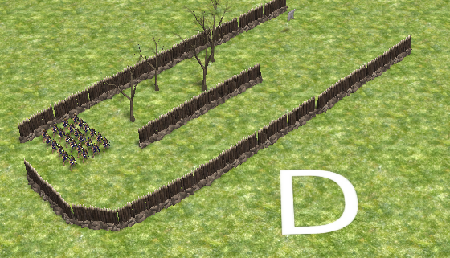

Formations
==========

> **[danger] Implementation status**
>
> This page is a work in progress. Assume that nothing described here is
> finalised yet and everything could work completely different in the end.

# Current state and Goal

Fighting in 0 A.D. should be diverse,
interesting and challenging. Good tactics should make it possible for a
player with a smaller and weaker army to win against a stronger
opponent. There should be multiple gameplay mechanics that enable the
players to use a variety of tactics and to counter tactics of their
opponents. Formations are a core element of battles, but there's
currently just a placeholder implementation which does not have a real
impact on how battles work in the game.

# Battalions vs Single units

Currently, all units in 0 A.D. are
controlled individually. A battalion is a new concept where units can
only be selected and moved as a group. Battalions can be put into a
formation.

## Training

### Approach A: Single units only

All units can be trained, selected and
ordered individually. For fighting, you usually use a formation because
that brings many tactical advantages and bonuses. This has some
advantages compared to battalions:

-   Garrisoning still works as designed. It would have to be redesigned
    for the battalion approach because the number of units in a
    battalion would exceed the room in some buildings.
-   The battalion system would cause some inconsistencies that don't
    occur here because it was designed that way from the beginning. A
    few examples:

* How would it work with female citizens in a battalion-only system? Are they also built in batches and how many units would be in such a batch?
* How do you show which units are part of the same battalion? While collecting resources, the individual units could get separated a lot. 
* When defining the size of a battalion, do we really want to depend on the economic factors too in addition to the military ones? For example, we would like a large battalion to make the formations work, be we want a small one for economic reasons. 
* How much space for units is there around the different resource types (mines, forests, hunting, berries, fields etc.)?
* We could still support mixing of different unit types in a formation if we want that.

On top of that, most of the disadvantages can be mitigated:

* The town bell takes away micro-management for garrisoning units and sending them back to work.
* There could be a shortcut and/or a button to select only wounded units
* Fighting happens in formations mostly, so the problem is solved on that part

### Approach B: Battalions only

Units are trained in battalions already
and they can't be separated. With a population cap of 300, it becomes
quite a task to manage all the units individually. Such management tasks
include:

-   Splitting units to collect different resources
-   Healing units or filtering out the insured units
-   Garrisoning units when the base gets attacked and sending the back
    to work afterwards

Training all units in battalions reduces the tedious micro-management
tasks and gives the player more time to do fun things.

### Decision

Approach A will be used. It seems like Approach B only
looks good in the beginning, but there are too many inconsistencies with
how the game is designed and it would require too much changes for only
little benefit.

## Fighting

If we support fighting in formation as well as fighting as
individual units, both need to be valid choices under some
circumstances.

### Fighting as individual units

* Garrisoning
* Raiding. A single formation is not mobile enough to run after individual units.
* Battles with few units. If all units are grouped into one or two battalions, it's hard for them to attack a scattered group of your units. If you have ranged units, you can keep attacking them while they try to catch all units one by one, wasting a lot of time. This tactic doesn't work well if the enemy has ranged units too. However, having just two battalions with one ranged and one melee, it's very hard to protect the ranged units. They can only be protected from one side at any given time. This is another case where you get an advantage by disbanding the battalion.

### Fighting with formations

* Basically all battles between larger armies.

# Number of units in formations

* There is a minimum number of 6 units for a battalion.
* There is a minimum number of units depending on the formation type. This is usually higher than the minimum battalion size.
* There is a maximum number of units for each formation.
* You get the same formation bonus irrespective of the formation size.
* Morale: The panic-effect on other battalions is smaller for smaller battalions
* Morale: You need to kill the same percentage of units in the same amount of time for all sizes of formations to cause panic-mode (assuming no other effects on morale).
* Morale: Smaller battalions panic more easily because fewer units need to be killed and they are also more vulnerable to other negative effects on morale because their total morale is lower.

# Unit types and formations

We need a decision how we restrict the type of units that can form a formation together.

## Allowing ranged and melee mix

Mixing ranged and melee units in the same formation is not allowed. An
important aspect of the system is the challenge of protecting the ranged
units against attacks from melee units and cavalry in particular.

# Forming and disbanding a formation

## Forming a formation

A formation is formed by selecting a number of
units and clicking the button of the desired formation. Buttons only
become active when all requirements are met. For example, a formation
requires a minimum number of units or it requires units of a specific
type. Formation bonuses start applying as soon as 90% (exact value TBD)
of the units have reached their designated location in the formation. If
the new bonus would apply instantly after ordering a different
formation, players could switch to different bonuses instantly while in
battle. This would be unrealistic and a problem for the visualization of
the bonus. Why would you get a different bonus when none of your units
actually move?

## Disbanding a formation

### Duration

Disbanding is instant.

Assuming a formation has a defense malus on the rear, you can instantly
get around this malus by disbanding. The downside is that forming the
formation again might not be possible if your units can't get into
position for the formation anymore. The other obvious downside is that
you also loose all bonuses.

### Conditions

Formations can be disbanded if their morale is above 50%
(exact value TBD). This prevents players from quickly disbanding a
formation before it gets into panic mode.

### Forced fallback to default formation

Different formations have
different minimum requirements for the number of units. This is meant to
be a higher value than the minimum battalion size because it should
encourage players to make larger battalions without having to increase
the lower limit for forced formation disbanding. As units in the
formation die, this minimum requirement suddenly isn't met anymore. In
this case, the formation falls back to a default formation. How this
happens exactly is a bit tricky because it should be visualized well to
the player and shouldn't look strange or unrealistic.

-   Revert animations to default (Example: units don't hold up their
    shields anymore in the testudo)
-   Without a move order, units stay where they are (they don't try to
    switch to default formation layout)
-   When moved, units are positioned according to default formation
    layout
-   Bonuses are instantly switched to default formation bonuses
-   The banner visualization is changed to the default formation
    visualization. This needs some clever artwork and GUI design. What
    we want to visualize here is "forced fallback to default formation".

### Forced disbanding

Battalions have a minimum requirement for the
number of units. As units in the battalion die, this minimum requirement
suddenly isn't met anymore. This causes the battalion and therefore also
the formation to get disbanded. Units can be selected individually again
and they loose all formation bonuses.

Considerations:

-   This means battalions close to the minimum size will usually disband
    before getting into panic mode. Because there are other ways to
    reduce morale than killing units, it's still possible that a
    battalion with minimum size gets into panic mode. It might also work
    to tune the system so that minimum-size battalions always go into
    panic mode when a unit dies.

# Fighting in formation

## Default behaviour (melee)

-   Units stay in formation until they are very close to an enemy.
-   When the first unit in the formation starts fighting, the other
    units attack too.
-   The first row of the formation moves forward until they are close
    enough to attack.
-   Units try to keep their flanks protected, meaning that the first row
    will stay connected during attack, but it will not stay a straight
    line unless the two fighting formations attack perfectly frontal.
-   Rows after the first one follow the units in front of them
-   When a unit in the first row dies, units from behind catch up

## Ranged

TODO

## Special behaviour

There are some special formations that might need
to stay in formation more strictly (TODO).

# Movement in formation

Formations have a larger obstruction than single
units and have difficulties pathing through narrow gaps. The following
approach is used to work around this issue.

-   When you issue a move order to a formation, the formation behaves
    differently depending on the distance from the destination
-   For a short distance it tries to move in formation and will query
    the pathfinder for the larger obstruction size.
-   If the distance is longer or if no path could be found with the
    large obstruction size of the formation, the units will change to
    column formation for the movement.
-   When moving in column formation, the units will re-establish the
    original formation when they are close enough to the target

TODO: Some open questions:

-   How wide is the column for movement? It looks weird if the column is
    too narrow, but anything wider increases the risk that no path can
    be found.
-   How does the formation choose between shorter paths that require a
    more narrow column or longer paths that allow movement in a wider
    column. Can it switch to a more narrow column somewhere in the
    middle of the path?

# Formation positioning

You click to the spot where the left side of the
formation should be placed and then drag your mouse to the right side.
Going further right means your formation will have more columns but less
rows. Clicking to the right and moving the mouse to the left on the
screen will do the same, but the formation will be turned 180 degree (so
the left side with respect to the formation is always where you start
click-dragging the mouse). Some formations may have a limitation how
many rows or columns they need as a minimum. Such restrictions will be
reflected in a preview while you are dragging the mouse.

# Directionality

So far, formations basically just reduce the number of
entities the player has to control and therefore make it possible to use
the rock/paper/scissors concept. To offer real tactical depth for
battles, we need some other means of getting an advantage over the
enemy.

## Formation based

Directionality for formations means that formations
have an orientation and units get different modifications for their
attack and/or defence values based on the direction they are facing
relative to the formation orientation. This can be used to achieve two
slightly different mechanics:

### 1. Surrounding

Assuming a formation can change its orientation
nearly instantly, the only way to take advantage of directionality is to
attack from more than one sides. The formation can turn quickly, but it
can't face two directions at the same time. It also feels quite apparent
that surrounding troops or attacking them from two sides should give you
some advantage and therefore the concept can be easily explained to
players.

### 2. Outmanoeuvring

If formations have a limitation how fast they can
turn, there's also the possibility of outmanoeuvring slow formations.
This could be applied to special formations like a Phalanx, which is
very deadly against cavalry when attacked from the front but vulnerable
when attacked from the back.

## Unit based

Unit based directionality means that a unit has weaker
armour on the back and the sides. If you attack a formation from the
side, the units there will obviously turn to face the attackers. They
have their defence values reduced because they are on the side of the
formation (formation directionality), but their defence values aren't
reduced further because the unit itself faces the attacker (unit
directionality). Unit based directionality applies in the following
situations:

### 1. Attacking units on formation-corners

If you manage to attack a
unit at the corner of a formation from the front and the side, you can
benefit from unit based directionality. To prevent this, players want to
close gaps between formations or make their formation wider than the
enemy formation. If the attacker manages to break the line completely,
this effectively doubles the number of corners and opens a way to get
behind the formation.

### 2. Wide formation with few ranks

As described above, formation
directionality favours very wide formations to make it harder for the
enemy to attack them from the side or from behind and to keep the
corners protected. With unit directionality added, wide formations get
more disadvantages. If the formation is so thin that you can not just
attack the formation from behind, but also the units, the attacker get
both bonuses. Unit attack range will have to be fine-tuned for this
effect to work. It might be good if at least some units could reach
further than one rank in the formation so that you also get a unit
directionality bonus when attacking a formation which is two ranks deep.

# Formation bonuses

Different types of formations give different
modifications to unit properties (attack, defence, move speed etc.).
There can be positive and negative modifications and modifications can
be directional (see directionality) or general.

# Morale

* The morale value for a battalion is the sum of the morale values of all its units.
* Winning without killing all enemies (adding more depth to a battle by offering another way to victory)
* Good for auras (heroes to boost morale, some units that scare the enemy and reduce their morale)
* Interesting for technology choices: boost attack and defense or morale?
* Morale is calculated per battalion
* When a formation is disbanded, all units take over the morale value of the formation (the percentage). This prevents that players quickly disband and then form a battalion again to refresh the morale. It's still possible to mix units with low and high morale to get a battalion with a morale value somewhere in the middle, but that's probably fine.

## What influences morale?

* Positive auras. Example: Hero close
* Negative auras. Example: Enemy elephant attacking reduces morale regeneration rate
* Experienced troops have increased morale
* Heavily armoured champion units have more morale. TODO: More armour effectively means more morale already because units die slower. Do they really need more total morale in addition? Maybe yes, because that makes them more resistant to the other effects on morale.
* Loss of units: The key here is that a dying unit reduces the morale points by more than the total number of points divided by the number of units. This means that a short and strong attack has a large impact on morale but a relatively low impact on the number of units in the battalion. 
* Morale automatically regenerates slowly. Regeneration is faster when the battalion is not in battle (Not in battle meaning something like: "not attacked since x seconds" or "total attack in the last 10 seconds smaller than X points")
* The battalion has a range. If another allied battalion within that range changes to panic mode, this also reduces the morale of the current battalion. This can cause a cascade effect which make the tactic of winning a battle by destroying the enemy morale stronger (this can be balanced by increasing or reducing the effect).

## What happens if morale reaches 0?

* The formation changes to panic mode
* This is indicated in some way (changed battalion banner, panic-animations playing for units from time to time, sound effects etc.)
* Units in panic mode have reduced attack and armour values and they loose all bonuses they had from the formation they were in previously. They play the panic-animation from time to time and don't fight while doing that.
* A formation in panic mode is so weak that it has to be pulled back from battle
* Units are still grouped
* Units keep their current positions, but they change to a panic mode formation (basically random grouping of units) which takes effect when the units are moved.
* Battalions in panic mode can't be disbanded
* Units recover from panic mode when their morale raises above 50% again (value to be adjusted during playtesting and balancing)

## Tactical considerations

* If a formation presents a larger front to the enemy, it inflicts more damage but is also more vulnerable to loosing morale. You might want to use a different formation layout depending on how strong the morale of your units is and how easily you can retreat them. For example, if you are fighting a battle in front of your own gates, you might want to quickly deal a lot of damage to the enemy troops and then retreat your panicing troops behind the walls.

# Stamina

The question is if we actually need stamina in addition to
morale because they are similar.

Brainstorming...

* Differentiate between light units that can move faster and further with their stamina and heavy units that can fight longer (different stamina use for movement and fighting)
* Practically increase the distance between settlements without requiring larger maps (movement takes stamina)
* Adding another aspect to battle. If you had a long march and then immediately start fighting, you have a disadvantage because of stamina

# Charging

TODO

# Potential issues

-   The mix between fighting with single units and fighting as
    formations is very tricky. Especially the transition between the two
    is quite hard to get right design-wise.

* Not enforcing minimum size requirements for formations and battalions could lead to "single-unit formations" or very small formations just to get the bonuses
* If forced disbanding happens too early, the main part of the battle will be fought in single unit combat again. This is not what we want.
* If formation bonuses are still applied for very small formations, that could be abused and could also lead to something similar as single unit combat. 

-   Confusion between forced fallback to default-formation and panic
    mode could occur.
-   Maybe it's too much to have panic mode, default-formation fallback
    and formation disbanding.
-   **Can more units attack at once if they aren't in a formation? Does
    this give formations a disadvantage that's hard to overcome?**

# Fallback

There are some parts of this design that could be removed
completely if testing shows that they don't work as expected.

## Minimum units for formation and fallback to default formation

Instead
of having a minimum requirement for the number of units per formation,
we could just have the minimum battalion size that applies to all
formations and remove the whole logic about falling back to default
formation completely. There would still be some good reasons to make
formations larger than the minimum size. Making them larger protects
them better against panic mode and forced formation disbanding. We might
want to start implementing it this way and see how it works.

# Movement in detail

## A: Corridor movement

**Goals:**

1. The formation picks the direct path
1. No units must turn around and walk backwards
1. The formation movement looks natural

**Decisions:** Nothing to decide, the expected behaviour is quite
obvious.

# B: Corridor movement marginally obstructed

**Goals:**

1. Same goals a s with A
1. The formation moves around the small obstacle (fence) in the middle. Roughly half of the formation should move around the left and half around the right of the fence (when it's in the middle).

**Decisions:**

1. Formations are allowed to split up in order to path around small obstacles. They don't require a path for the full formation obstruction.

# C1: Too narrow target location (no alternative)

**Goals:**

1. The formation is allowed to move to the flag, even though there's too little room for the whole formation obstruction.
1. The formation ends up with more ranks but less wide to fit into the narrow spot

**Decisions:**

1. It's allowed to move formations to a target when there's not enough space for the whole formation at the target location.
 * Different behaviour would be a problem, especially with large formations and unrevealed territory
 * It doesn't seem too difficult to achieve a reasonable behaviour in the vast majority of cases

# C2: Too narrow target location (alternative path)

TODO: This is where it gets difficult. Maybe this needs another testcase
that elaborates on the behaviour.

1. Does the formation use the same behaviour as in C1 or does it try to position units outside of the wooden walls too, trying to keep the formation shape?
 * Different behaviour might be wanted depending on how much distance (real walk distance, not linear distance) units have to cover to reach that spot.
 * The player might not want units to walk through the narrow gap and take the way on the front if enemy units are there.

# D: Partially obstructed paths with alternative

**Goals:**

1. The formation picks the direct path (where the trees are).
1. Movement looks natural (no units going back and forth for example). 

**Decisions:**

1. Formations always pick the shortest path, even if it's partially obstructed (all individual units in the formation can pass, but not the formation as a whole) and even if a free (but longer) path is available.
 * Different behaviour would not be predictable for the player and it would be very hard to implement a reasonable fuzzy logic that covers all the cases well.

# E: Dense forests

**Goals:**

1. The formation picks the direct path.
1. Units pick reasonable paths to get through the forest and keep close together as good as possible. They try to keep the formation shape if possible, otherwise they just try to keep as close together as possible.
1. Formation movement looks natural.

**TODOs:**

1. If formations move through dense forests or similar obstacles and units separate too much, this should have an impact on formation bonuses. Is it enough to use a rule like "if less than x% of the units are in their designated location according to the formation shape, bonuses do not apply"?

