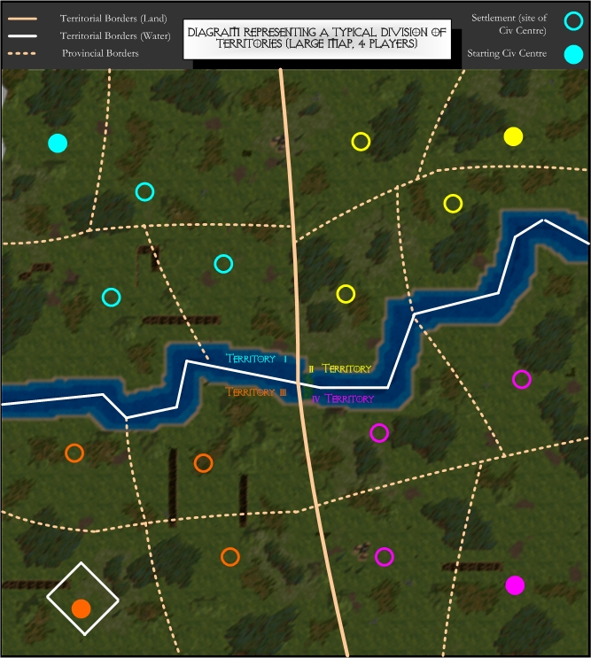

TERRITORIES
===========

!!! warning

    This page describes a feature that is implemented, but the implementation
    significantly differs from the text here. The text is to be updated.

PROVINCES
---------

When this game mode is enabled, every map will be comprised of a number
of Provinces. That number is determined during game session creation.

Every Province will have a Settlement in it that players may 'settle'.
When a player takes that action, they effectively declare ownership of
that Province; which adds the Province to the player's Territory.

Ideally, the Provinces will be evenly sized and have roughly equal
available resources. They will also follow natural boundaries such as
forest lines, roads, rivers, islands, etc.

SETTLEMENTS
-----------

Each Province is centralised around that Province's Settlement. If no
player controls the Settlement, it is owned by Gaia. That means there
are no penalties for traversing across it and it is free to be taken by
any player.

To take control of a Province, construct a Civic Centre on its
Settlement. Destroying an enemy Civic Centre will cause it to revert
back to being a Settlement. Because Gaia now owns it, all bonuses and
penalties to players in the Province are now null.

Settlements are indicated on the Mini Map using a unique symbol.

CIVIC CENTRES
-------------

A player gains control of a Province by building a Civic Centre upon the
site of the Settlement.

In Territory game mode, this is the only way to build additional Civic
Centres.

Each player begins the game with control of one Province, via a
"starting" Village Centre (unless he is playing the Nomadic game mode,
in which case he will begin with only starting units and will first need
to hunt down an available Settlement to build his first Civic Centre).

Destroying an enemy Civic Centre reveals the Settlement at its
foundation, allowing the player to build his own upon the site and seize
control of the Province (any structures and units will still remain in
the Province).

BENEFITS OF CONTROLLING A PROVINCE
----------------------------------

* The player sees no Shroud of Darkness in his own Provinces.
* Expanding his Territory allows the player to control more of the game map.
 * He cannot easily build structures on terrain unless he controls its Province.
 * He cannot gather from resource objects unless he controls their Province.
* Until the 'rush timer' has ticked down to zero, units will rapidly lose hitpoints whenever they are in an enemy's Province. (The starting time of the timer is specified at session creation.)
* Faster construction time: In situations where the player can build around existing buildings in a Province he doesn't own (see the next section), he cannot build as quickly in the other player's Province as he could in his own.
* Civic Centres increase population limit, so more units can be trained.
* All of the player's entities gain a bonus to their armour value as long as they are in one of his Provinces.

STRUCTURES IN PROVINCES
-----------------------

To repeat, one of the big advantages of owning a Province is that you
can easily construct structures in that province. However this is not
the only way.

Requirements to build:

* Build a Civic Centre on the Settlement
  This is your first initial step to construction of any structure in any Province.
* Capture a structure from the enemy
  If you cannot construct a structure and you really want to build a structure in that Province, another option is to weaken the enemy's structure to the point of capturablity. After it is captured you are capable of building structures in its proximity.
* Have a structure already built in the Province
  This is an issue when an enemy comes into your Province and destroys your Civic Centre. You are still able to build in this Province within the proximity of your existing structures.

ALLIED PROVINCES
----------------

A player may build defensive and military (but not economic) structures
within a Province controlled by an ally.

It is not permitted to seize ally-controlled Provinces unless the player
destroys their Civic Centre. If they take such an action, the player
forfeits ownership of that province to their ally (or whoever builds on
top of the settlement first).

TERRITORIES
-----------

A Territory is defined as a player's collection of Provinces.

PROVINCIAL BORDERS
------------------

The outer edges of the terrain a player controls will be marked on the
Mini Map in such a way for the player to visualise ownership of that
Province. It will also be encouraged to represent this on the game map.
